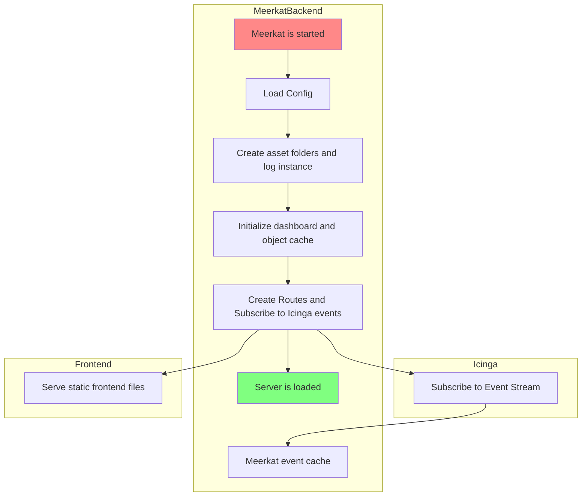
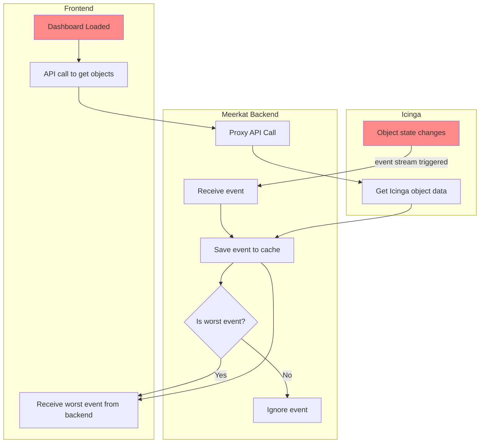

## Diagrams
### Meerkat 

### Meerkat Event Changes

## dashboardCache
dashboardCache is recreated on icinga reload for all dashboards
dashboardCache is reloaded for single dashboard on actions such as edit/update.

## cache
cache contains list of dashboards, each dashboard contains list of elements, each element contains information such as element type (host/service/servicefilter/etc), name, last event values (this is the current element showing on the dashboard as it is the worst element according to the severity order), and list of object names that are associated with that element.

for the events to be updated on the dashboard the element needs to have the object being updated in its object list in cache.

## Icinga to Cache
getObjectHandler in dashboard.go is the main function where it makes the requests for icinga objects and puts them in cache and returns them to the frontend this function is very important as it builds the element cache for events to successfully go through.

## Cache to Dashboard
handleKey in events.go is the function that handles the StateChange and CheckResult events coming through to meerkat. In the function we go through all the elements and all the objects for each element checking if its in the element list and if it is checking if it is worse than the current worse (unless its the same object then force update) if it is we send an event to the frontends to update their dashboard.

## Unit Tests
currently in `cmd/meerkat/icinga_test.go`
unit tests on event handling could be done by creating an instance of the struct Dashboard and using random information
next step would be to create an []ElementStore instance and fill it with elements to test status.
next step would be to create Event instances with information you want and calling handleKey on the values.
then you would check the elementStore to see if the elements last event was the correct event it should have displayed.

## Debug Url's
https://meerkat.hq.sol1.net:8585/api/cache (Shows all dashboards and their cache)
https://meerkat.hq.sol1.net:8585/api/cache/[dashboard-slug] (Shows the cache for a single dashboard)
https://meerkat.hq.sol1.net:8585/api/status (Shows overall status of meerkat such as open dashboards, previous requests, previous events and icinga information)
https://meerkat.hq.sol1.net:8585/cache (A page that allows you to clear object and dashboard cache with a button click)