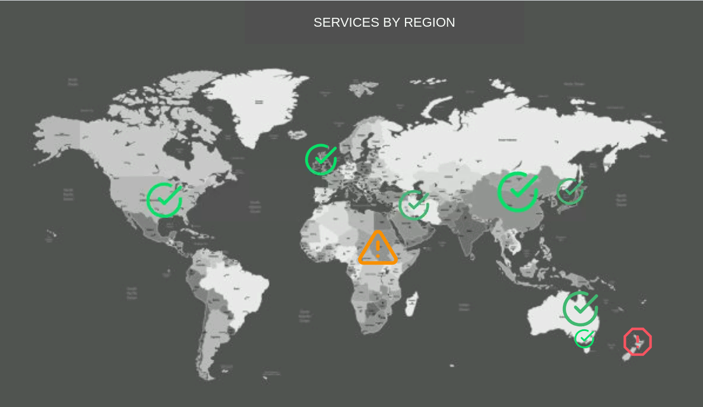

# Meerkat

A utility to create and share dashboards for icinga2 checks and hosts. Meerkat a lightweight service which only requires a Go server and a small amount of javascript (only 14KB gzipped) for the frontend. It's quick to setup and easy to use. There is an editor interface when you can set a background for a dashboard and start overlaying checks which update by polling the Icinga2 API via the Meerkat backend.




Dashboards are saved as json files under the `dashboards` directory which get generated on startup, so backing up or moving data is easy. The `dashboard-data` directory is for image/file data.

**This tool is designed to be used internally, there is no user management and it has direct access to the Icinga2 API (with some minor filtering) I would not recommend putting this on the internet. You can limit the API user using filters as per the Icinga docs here: https://icinga.com/docs/icinga2/latest/doc/12-icinga2-api/#icinga2-api-permissions **


### Quick Start
Deploying from the docker hub image is the easiest way to get started.

Copy `config/meerkat.toml.example` to `config/meerkat.toml`, edit `config/meerkat.toml` using your favourite editor, then invoke your favourite composer:
```
docker-compose up
```
or
```
docker stack deploy -c docker-compose.yml meerkat
```

The default `docker-compose.yml` uses the directories `config/` `dashboards/` and `dashboards/` for data persistance.  Feel free to edit docker-compose.yml as you see fit though, of course.

We have also included a Dockerfile in case you want to build your own image.

### Build without Docker
You will need an up to date go, and an up to date npm install to build Meerkat. The steps below aren't tested with each release, but should get you started.

* ```go build``` in the root directory of this project to build the server
* From the frontend directory run ```npm i``` which installs JS dependencies

* ```npm run prod``` from the frontend directory which builds the frontend code (index.html loads this output (bundle.js))
* You can then run ```./meerkat -config meerkat.toml``` after creating the config file above

Meerkat will need a valid config file to start - the following is a sample:

### Configuring Meerkat
```
HTTPAddr = "[::]:8585"

IcingaURL = "https://icinga.example.com:5665"
IcingaUsername = "meerkat"
IcingaPassword = "meerkatpassword"
IcingaInsecureTLS = true
```

The username and password you will use should be configured in the Icinga2 api-users.conf. Here is an example:

```
object ApiUser "meerkat" {
  password = "meerkatpassword"

permissions = [ "objects/query/Host", "objects/query/Service", "objects/query/ServiceGroup", "objects/query/HostGroup" ]
}
```

And don't forget to restart Icinga2 after updating that config file.


### Using Meerkat

Once you have Meerkat up and running, you will want to create your first dashboard. Its probably best to have a sensible background first. The background needs to be a browser displayable image, even an animated gif is possible! We have used diagram tools for backgrounds, pictures of racks, world maps etc. It helps if you have thought about how you want the checks and background image to overlay together beforehand. You can author the Background Image in any program that can spit out image files that browsers can display, we have tested png, jpeg and webp.

1) Make a new dashboard by clicking Create New Dashboard button and giving it a name. Dashboards can then be edited and viewed from the main page.
2) Edit your dashboard and add a Background Image.
3) Add new Elements and pick the type of Element you want to add.
4) Drag and drop your Element over the top of the map to somewhere that makes sense relative to the background. You can resize and rotate elements.
5) Remember to click Save. Many times.
6) Once done, click Home and then view your dashboard.

### Element Types

Meerkat supports various element types, some sourced from the Icinga API backend, and others static.
Icinga type elements can select from the following sources: Hosts, Services, Host Groups, Service Groups, Host Filter, Service Filter and All Services on a Host.
These sources are largely self-explanatory, however the filter language for the Filter sources is a little unintuitive. The base doco is here: https://icinga.com/docs/icinga2/latest/doc/12-icinga2-api/#advanced-filters and some hints are provided in the input dialog. You can also set a Linking URL for these elements which let you link to somewhere else, like another dashboard, or Icingaweb.


#### Icinga Card
A simple rectangular card that displays the status of the check. You can adjust the font size.

#### Icinga SVG
You can select an SVG to toggle between for the various states. The default SVGs are sensible, however feel free to choose whatever makes sense to you. There isn't a way to change the global defaults just yet.

#### Icinga Image
Select a set of images you want to toggle between on state change.

#### Icinga Line
Allows you to draw lines, you can rotate and resize them, and set the weight. They only toggle between OK, Warning, Critical, Unknown at present.

#### Static Text, SVG and Image
Useful for adding headings or labels.

#### HLS and Audio Stream
Embed video or audio streams in the dashboards in case staring at the dashboard is boring. (or you really care about the video!)

### Sounds
Meerkat allows you to specify a global sound scheme for state change, as well as upload custom sounds. Each check can also have different sounds triggered on state change. Yes you can have the sysadmin DJ soundboard of doom you always wanted!


Future enhancements may include:
* Authentication support (though it is meant to be displayed on a wall, without auth mostly)
* Automation for creation of the dashboard config, allowing for easy mass creation of dashboards from Icinga data
* Automation for export of Meerkat dashboards to Business Processes

### Development with Docker Compose

Please install [Docker Desktop](https://www.docker.com/products/docker-desktop).

```
host$ cp config/meerkat.toml.example config/meerkat.toml
host$ # customize config/meerkat.toml
host$ docker-compose up be fe
host$ curl localhost:8585
host$ # hack backend/* frontend/src/*
host$ # profit!
```

### Deploy a Docker Hub Image
clone meerkat to a docker host 
You may need to use `docker login hub.example.net` if you haven't configured auth

```
docker build --tag hub.example.net/meerkat:latest 
docker image push hub.example.net/meerkat:latest
```


### Support
Sol1 is an official Icinga Enterprise Partner, and can offer commercial support for Meerkat and Icinga and friends. We are a friendly bunch of people, so please don't hesitate to get in touch at http://sol1.com.au

### Contributing
We welcome any contributions. Let us know via the issues here if there is something you need fixed up, or even better, a patch or PR would be most appreciated.

[Sounds from Notification Sounds](https://www.notificationsounds.com) provided under the creative commons 4.0 license

License is GNU Affero GPLv3.
